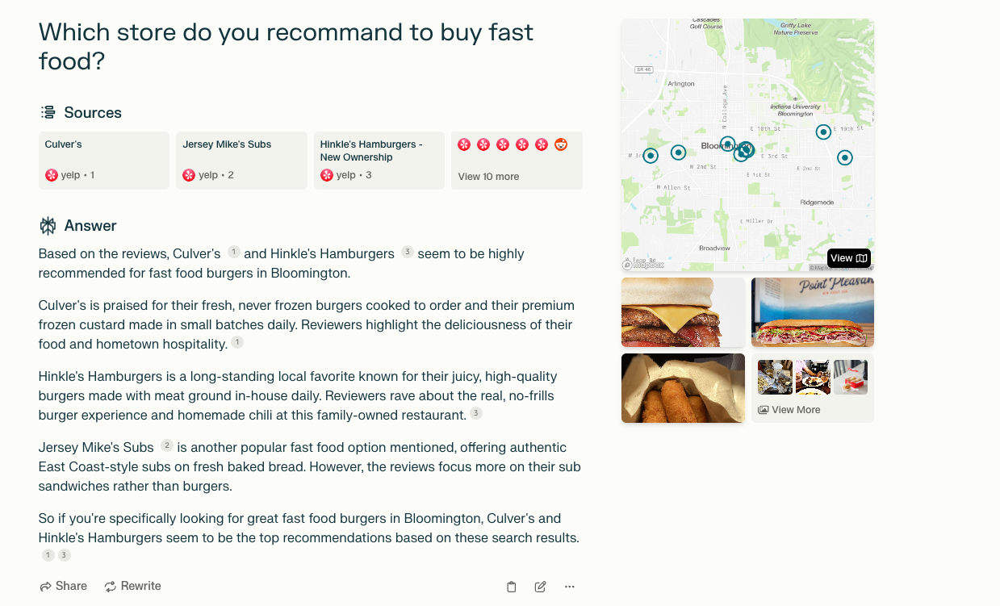

# Potential Attack Surfaces

## Weak validation of the input data from AI side in compositional systems.

From [this paper](https://arxiv.org/pdf/2309.10254):

> As for suggestions, OpenAI suggests that plugins implement API request rate limits [29] and provides an IP address range for OpenAI servers so that plugins can add it to their allow lists [30].

- API list: <https://github.com/dannyp777/ChatGPT-AI-Plugin-Manifest-Lists>
- AI-based custom services
- AI-invoked plugins

## Data Harvesting

- Excessive data might be transferred to the backends when calling the API.

## Privacy Concerns

- How does perplexity know my address?

- Domain specific AI ([EvenUp](https://www.evenuplaw.com) and [Harvey](https://www.harvey.ai/)): _AI Zero-Day Data Retention_

## Honeypot GPTs

- Free GPT instance deployment on cloud

## Browser Plugins

# Resources

- Models: <https://top.aibase.com/ranking/top>
